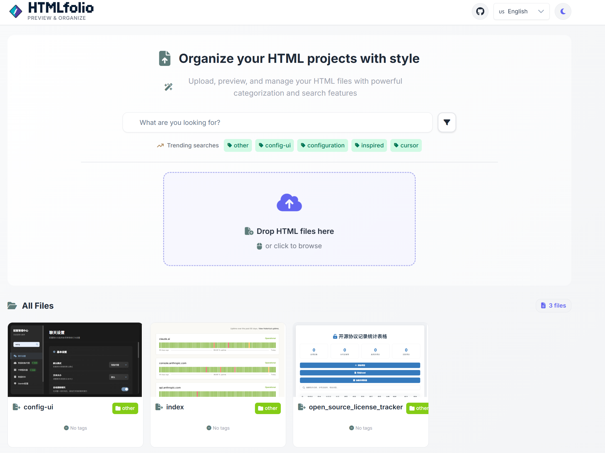
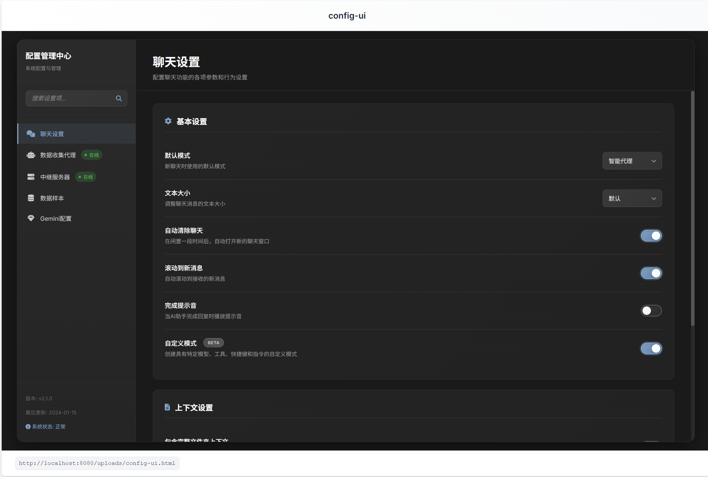
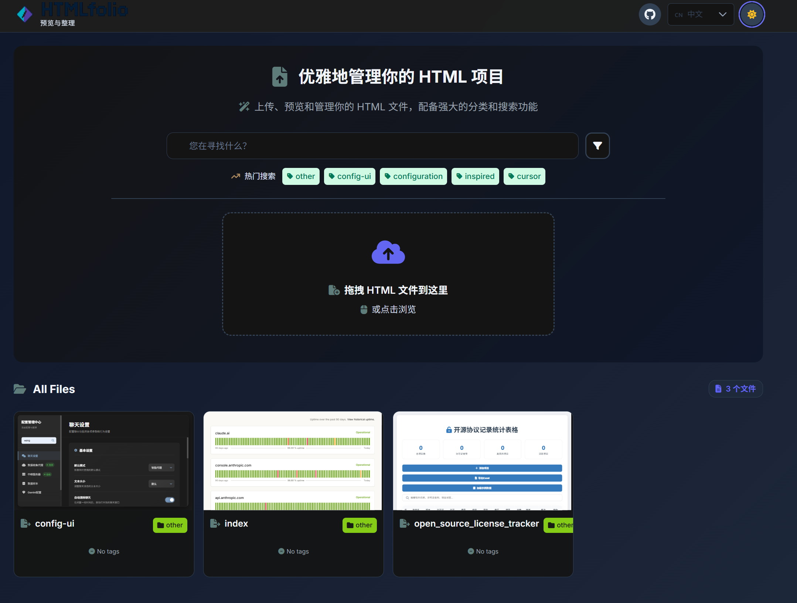
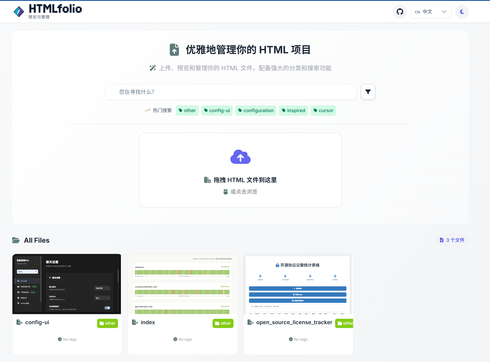
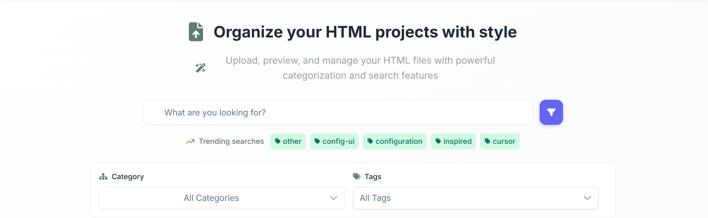
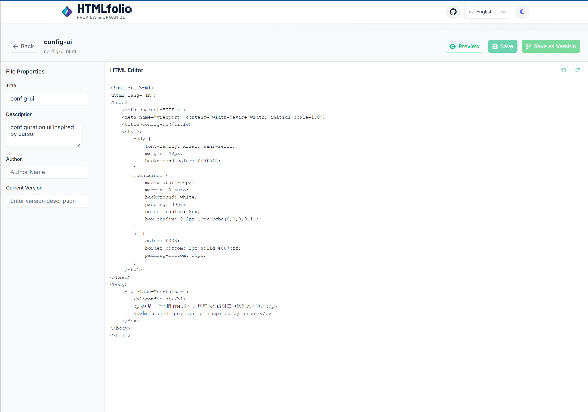

# HTMLfolio

**English** | [简体中文](./README_zh.md)

A modern HTML file management and preview tool designed for developers and designers. It provides an elegant interface to centrally manage all your HTML files, supporting powerful features like file uploads, instant previews, category and tag management, a multi-language UI, and version history.



## 🚀 Features

### UI & UX
- ✅ Elegant light and dark themes
- ✅ Responsive design for various devices
- ✅ Internationalization support (Chinese/English)

### Core Features
- ✅ HTML file upload and management
- ✅ Instant online preview
- ✅ File categorization and tagging system
- ✅ Full-text search and multi-dimensional filtering
- ✅ Version history tracking for HTML files

### Deployment & Maintenance
- ✅ One-click Docker containerized deployment
- ✅ Health check monitoring endpoint
- ✅ Persistent data storage

## 📸 Feature Preview

| Feature | Screenshot |
| :--- | :--- |
| **File Preview** |  |
| **Elegant Dark Mode** |  |
| **Clean Chinese Interface** |  |
| **Powerful Filtering & Search** |  |
| **HTML Version Management** |  |

## 📋 Tech Stack

- **Frontend**: Angular 19 + PrimeNG
- **Backend**: Go + Gin
- **Storage**: File Storage (JSON)
- **Deployment**: Docker + Docker Compose

## 🛠️ Quick Start

### Prerequisites

- Docker Desktop
- Git

### One-Click Deployment

1. **Clone the project**
   ```bash
   git clone https://github.com/wangyaxings/HTMLfolio
   cd HTMLfolio
   ```

2. **Run the deployment script**

   **Windows:**
   ```bash
   deploy.bat
   ```

   **Linux/macOS:**
   ```bash
   docker-compose -f docker-compose-lite.yml up --build -d
   ```

3. **Access the application**

   Open your browser and go to: http://localhost:8080

## 📁 Project Structure

```
20250522/
├── Dockerfile                    # Docker build file
├── docker-compose-lite.yml     # Lightweight deployment configuration
├── deploy.bat                   # Windows deployment script
├── env.example                  # Environment variable example
├── go-backend/                  # Go backend code
├── primeng-frontend/            # Angular frontend code
└── data/                        # Data persistence directory
    ├── uploads/                 # Uploaded files
    ├── db/                      # Database files
    └── backups/                 # Backup files
```

## 🔧 Management Commands

### Check service status
```bash
docker ps
```

### View logs
```bash
docker logs -f 20250522-app-1
```

### Stop services
```bash
docker-compose -f docker-compose-lite.yml down
```

### Restart services
```bash
docker-compose -f docker-compose-lite.yml restart
```

### Complete redeployment
```bash
docker-compose -f docker-compose-lite.yml down -v
docker-compose -f docker-compose-lite.yml up --build -d
```

## 🌐 API Endpoints

- **Health Check**: `GET /api/health`
- **List Files**: `GET /api/files`
- **Upload File**: `POST /api/upload`
- **Delete File**: `DELETE /api/files/{filename}`
- **List Categories**: `GET /api/categories`

## 📝 Usage Instructions

1. Visit http://localhost:8080 to open the HTMLfolio application.
2. Click the upload area or drag and drop an HTML file to upload.
3. The system will automatically use the filename (without the extension) as the title.
4. Fill in the file information (description, category, tags).
5. After upload, the file will appear on the interface immediately.
6. Supports filtering and searching by category and tags.

## 🔍 Troubleshooting

### Port is already in use
```bash
# Find the process using port 8080
netstat -ano | findstr :8080

# Terminate the process (replace <PID>)
taskkill /PID <PID> /F
```

### Container fails to start
```bash
# Check container logs
docker logs 20250522-app-1

# Rebuild the image
docker-compose -f docker-compose-lite.yml up --build -d
```

## 📄 License

MIT License

## 👨‍💻 Author

wangyaxings

---

**After deployment, visit http://localhost:8080 to start using HTMLfolio!** 🎉