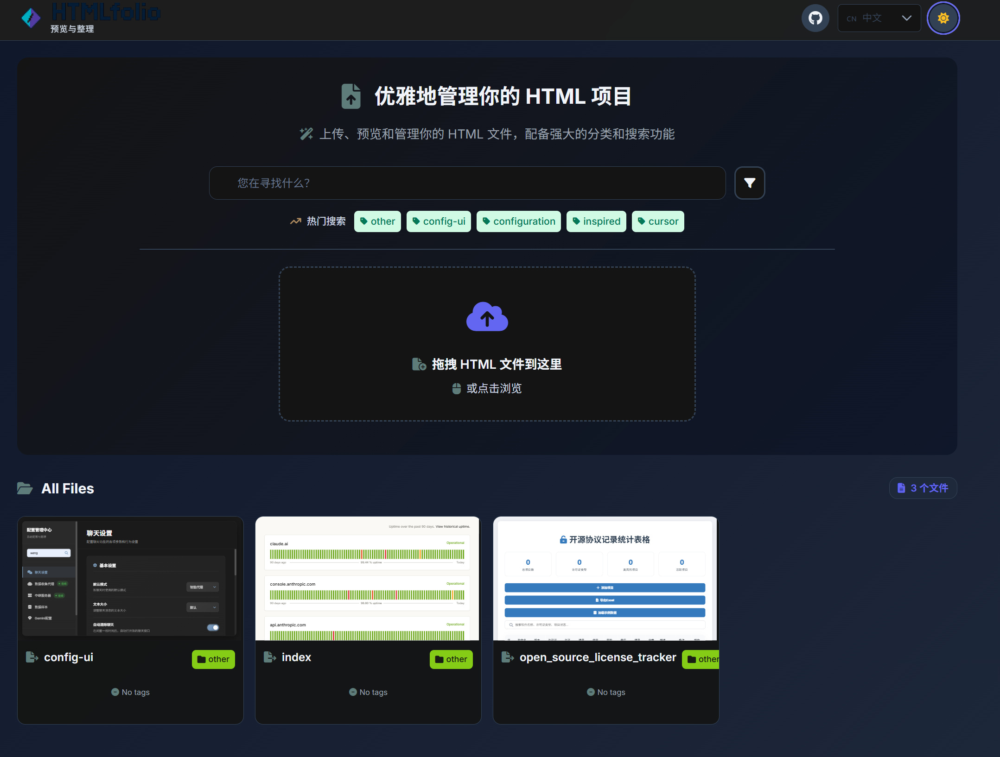
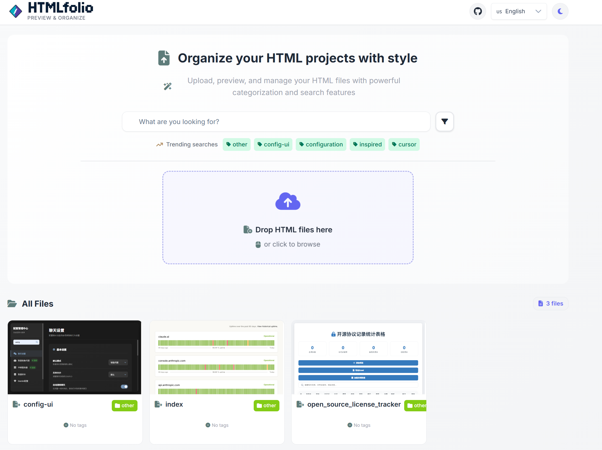
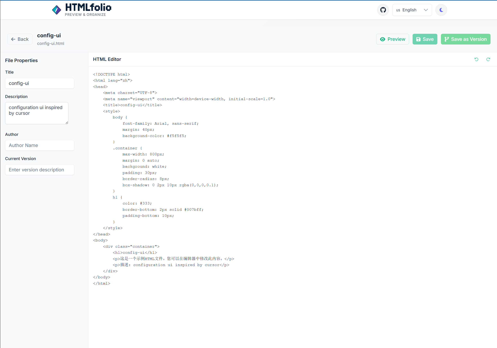

# HTMLfolio

[English](./README.md) | **简体中文**

一个专为开发者和设计师打造的现代化HTML文件管理和预览工具。它提供了一个优雅的界面来集中管理您所有的HTML文件，支持文件上传、即时预览、分类和标签管理、多语言界面和版本历史等强大功能。


## 🚀 功能特性

### 界面与体验 (UI & UX)
- ✅ 优雅的亮色和暗黑主题
- ✅ 响应式设计，适配不同设备
- ✅ 国际化支持（中文/英文）

### 核心功能 (Core Features)
- ✅ HTML文件上传和管理
- ✅ 即时在线预览
- ✅ 文件分类和标签系统
- ✅ 全文搜索和多维度筛选
- ✅ HTML文件版本历史追踪

### 部署与维护 (Deployment & Maintenance)
- ✅ 一键式Docker容器化部署
- ✅ 健康检查监控端点
- ✅ 数据持久化存储

## 📸 功能预览

| 功能 | 截图 |
| :--- | :--- |
| **文件预览** |  |
| **优雅的暗黑模式** |  |
| **国际化英文支持** |  |
| **强大的筛选与搜索** |  |
| **HTML版本管理** |  |

## 📋 技术栈

- **前端**: Angular 19 + PrimeNG
- **后端**: Go + Gin
- **存储**: 文件存储 (JSON)
- **部署**: Docker + Docker Compose

## 🛠️ 快速开始

### 前提条件

- Docker Desktop
- Git

### 一键部署

1. **克隆项目**
   ```bash
   git clone https://github.com/wangyaxings/HTMLfolio
   cd HTMLfolio
   ```

2. **运行部署脚本**

   **Windows:**
   ```bash
   deploy.bat
   ```

   **Linux/macOS:**
   ```bash
   docker-compose -f docker-compose-lite.yml up --build -d
   ```

3. **访问应用**

   打开浏览器访问: http://localhost:8080

## 📁 项目结构

```
HTMLfolio/
├── Dockerfile                    # Docker镜像构建文件
├── docker-compose-lite.yml     # 轻量级部署配置
├── deploy.bat                   # Windows部署脚本
├── env.example                  # 环境变量示例
├── go-backend/                  # Go后端代码
├── primeng-frontend/            # Angular前端代码
└── data/                        # 数据持久化目录
    ├── uploads/                 # 上传文件
    ├── db/                      # 数据库文件
    └── backups/                 # 备份文件
```

## 🔧 管理命令

### 查看服务状态
```bash
docker ps
```

### 查看日志
```bash
docker logs -f <container_name>
```

### 停止服务
```bash
docker-compose -f docker-compose-lite.yml down
```

### 重启服务
```bash
docker-compose -f docker-compose-lite.yml restart
```

### 完全重新部署
```bash
docker-compose -f docker-compose-lite.yml down -v
docker-compose -f docker-compose-lite.yml up --build -d
```

## 🌐 API端点

- **健康检查**: `GET /api/health`
- **文件列表**: `GET /api/files`
- **上传文件**: `POST /api/upload`
- **删除文件**: `DELETE /api/files/{filename}`
- **分类列表**: `GET /api/categories`

## 📝 使用说明

1. 访问 http://localhost:8080 打开HTMLfolio应用
2. 点击上传区域或拖拽HTML文件进行上传
3. 系统会自动使用文件名（去掉扩展名）作为标题
4. 填写文件信息（描述、分类、标签）
5. 上传完成后文件会自动显示在界面上
6. 支持按分类、标签筛选和搜索文件

## 🔍 故障排除

### 端口被占用
```bash
# 查看占用8080端口的进程
netstat -ano | findstr :8080

# 终止占用进程（替换PID）
taskkill /PID <PID> /F
```

### 容器启动失败
```bash
# 查看容器日志
docker logs <container_name>

# 重新构建镜像
docker-compose -f docker-compose-lite.yml up --build -d
```

## 📄 许可证

MIT License


---

**部署完成后访问 http://localhost:8080 开始使用HTMLfolio！** 🎉